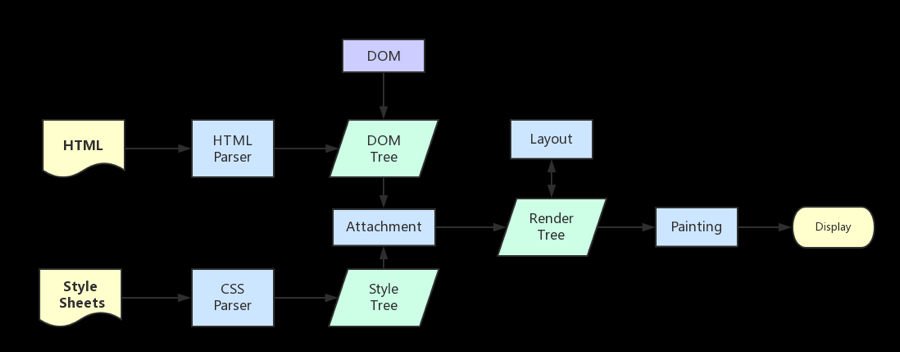
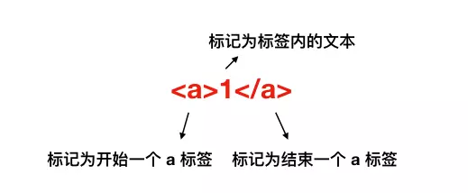

## 渲染流程图示

### 解析 HTML 文件

token：标记，本质上还是字符串，是构成代码的最小单位，这一过程会将代码分为一块块，并在这些内容打上标记，便于理解这些最小单位的代码是什么意思

### 解析 CSS 文件

### 生成渲染树

渲染树只会包含需要显示的节点和这些节点的样式信息，如果这个节点是 display: none，那么就不会在渲染树上显示
当浏览器生成渲染树以后就会根据渲染树来进行布局（回流），然后调用 GPU 绘制，合成图层，显示在屏幕上

## 操作 DOM 慢的原因

DOM 属于渲染引擎中的东西，JS 又是 JS 引擎中的东西，当通过 JS 操作 DOM 的时候，其实这个操作涉及到了**两个线程之间的通信**，那么势必会带来一些性能上的损耗，操作 DOM 次数一多，也就等同于一直在进行线程之间的通信，并且操作 DOM 可能还会带来**重绘回流**的情况，所以就导致了性能上的问题

## 什么情况阻塞渲染

渲染的前提是生成渲染树，所以 HTML 和 CSS 肯定会阻塞渲染，如果想渲染的越快，就越应该降低一开始需要渲染的文件大小，并且扁平层级，优化选择器
然后当浏览器解析到 script 标签时，会暂停构建 DOM，完成后才会从暂停的地方重新开始，也就是说，如果你想首屏渲染的越快，就越不应该在首屏就加载 JS 文件，这也是都建议将 script 标签放在 body 标签底部的原因。
当然在当下，并不是说 script 标签必须放在底部，因为你可以给 script 标签添加 defer 或者 async 属性。
当 script 标签加上 defer 属性以后，表示该 JS 文件会并行下载，但是会放到 HTML 解析完成后顺序执行，所以对于这种情况你可以把 script 标签放在任意位置。
对于没有任何依赖的 JS 文件可以加上 async 属性，表示 JS 文件下载和解析不会阻塞渲染。

## 重绘和回流

重绘会在设置节点样式时频繁出现，同时也会很大程度上影响性能

- 重绘是当节点需要更改外观而不会影响布局的时候发生，比如改变 color 就叫重绘
- 回流是布局或者几何属性需要改变就称为回流

回流必然会引起重绘，重绘不一定为引发回流

## 减少重绘和回流

- 使用 transform 代替 top
- 使用 visiblity 代替 display: none（前者引起重绘，后者引起回流）
- 不要把节点的属性值放在一个循环里当循环的变量
- 不要使用 table 布局
- 动画的选择
- CSS 选择符从右到左匹配查找，避免节点层级过多
