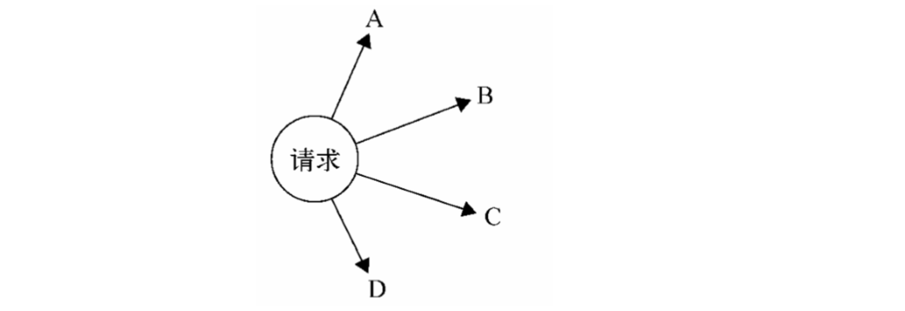
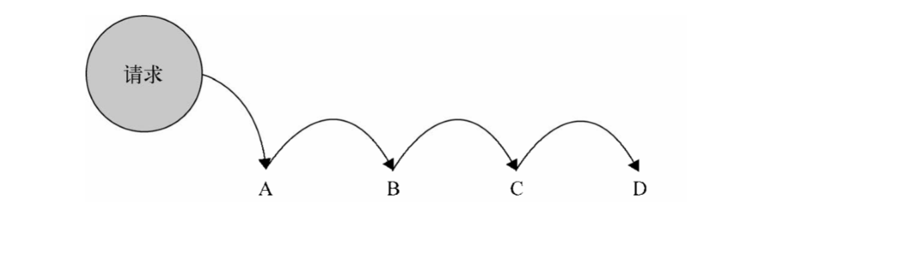

# WHAT

使多个对象都有机会处理请求，从而避免请求的发送者和接收者之间的耦合关系，将这些对象练成一条链，并沿着这条链传递该请求，直到有一个对象处理它为止





# WHY

- 职责链模式解耦了请求发送者 A 和 N 个接收者之间的复杂关系，由于不知道链中的哪个节点可以处理你发出的请求，所以你只需要把请求传递给第一个节点即可
- 使用职责链后，链中的节点可以灵活拆分重组，增加/删除/改动一个节点都轻而易举
- 可以手动指定起始节点，请求并不是非得从链中的第一个节点开始传递，这样就可以减少请求在链中的传递次数，更快的找到合适的请求接收者

# HOW

```javascript
function a(x) {
  return false;
}
function b() {
  console.log(2);
  return true;
}
function c() {
  console.log(3);
}

// 职责链模式普通实现
class Chain {
  constructor(fn) {
    this.fn = fn;
    this.successor = null;
  }
  setNextSuccessor(successor) {
    return (this.successor = successor);
  }
  passRequest() {
    let ret = this.fn.apply(this, arguments);
    if (ret === false)
      return (
        this.successor &&
        this.successor.passRequest.apply(this.successor, arguments)
      );
    return ret;
  }
}
let aChain = new Chain(a);
let bChain = new Chain(b);
let cChain = new Chain(c);
aChain.setNextSuccessor(bChain);
bChain.setNextSuccessor(cChain);

aChain.passRequest(12); // 2

// AOP实现职责链模式
Function.prototype.after = function(fn) {
  let _self = this;
  return function() {
    let tmp = _self.apply(this, arguments);
    if (tmp === false) return fn && fn.apply(this, arguments);
    return tmp;
  };
};

a.after(b).after(c)(12); // 2
```
